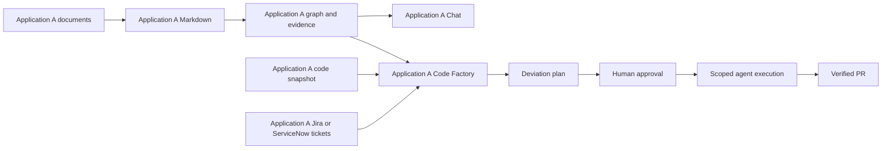

# Digital Brain — End-to-end architecture and operating narrative

Design review edition • 12 September 2026 • No application implementation

**Each application has its own secure knowledge.** The SaaS platform administers organizations, portfolios, products and applications. Inside an application, users upload documents, convert them into Markdown, generate and store a verified knowledge graph, and use that knowledge through Chat and Code Factory.

## Diagram guide

- [Platform and its applications](platform-applications.html): the complete product flow.
- [SaaS infrastructure and security](architecture.html): identity, metadata, jobs and private stores.
- [Detailed graph generation](graph-generation.html): evidence, extraction, identity resolution, quality and persistence.
- [Detailed graph retrieval](graph-retrieval.html): authorization, entry-point search, traversal and cited evidence.
- [Document and graph-quality workflow](workflow.html): ingestion, rejection and correction.
- [Code Factory workflow](code-factory-workflow.html): analysis, approval, execution, PR and verified closure.

## A concrete end-to-end story

Consider an illustrative organization called Northstar. Its organization administrator creates the Commerce portfolio. The portfolio manager creates the Payments product. The product manager registers the Refunds application and its repositories. A separate Checkout application may sit under the same product, but it has no access to the Refunds documents, graph, conversations or tickets.

The SaaS administrator manages Northstar's subscription, capacity and operational status. They do not automatically receive its application content. The organization administrator manages identity and delegation. Portfolio and product managers organize work and assign permitted responsibilities. Application knowledge access is granted explicitly; organizational seniority does not turn the graphs into a shared corpus.

The Refunds application owner grants a contributor upload access and a product specialist review access. The contributor uploads the functional specification. The platform scans it, stores the original privately, converts it to Markdown, and records source references. Graph workers extract requirements and relationships. Quality checks identify an unreadable exception table; the improvement inbox asks the owner for a corrected source. After correction and verification, a new Refunds knowledge version becomes active.

A user opens Refunds Chat and asks how approval works. Retrieval resolves the question against Refunds knowledge, fetches relevant policy passages and graph evidence, and returns a cited answer. The system does not search Checkout, even if that user also has Checkout access. Changing applications starts a different knowledge context.

The owner then requests a Refunds Code Factory assessment. The system enumerates the approved requirements and compares them against pinned, permitted repository snapshots. It distinguishes supported deviations from unknowns and produces a plan showing evidence, intended changes, tests and risk. An authorized approver reviews the plan. Only approved work is dispatched to application-isolated agents.

The agents prepare fixes and tests, an independent review checks them, and the system creates a review PR under the approved permissions. Repository policy controls merge. Once the change is merged, the Refunds graph is updated from the merged commit and the original deviation is checked again. If configured, a Jira or ServiceNow update records the verified outcome. A ticket is not automatically closed simply because a patch or PR exists.

The same process can begin with a bug imported from the Refunds application's configured Jira project or ServiceNow filter. The connector brings in only that application's eligible records. Imported ticket text is evidence to analyze; it cannot bypass approval or instruct an agent to access another application.

The following parts provide the full architecture, role matrix, graph internals, connector setup, quality controls and retrieval decision rationale.

**Revision status:** The full narrative now includes configurable models and application REST/MCP endpoints. The six rendered diagrams show the previous validated revision; their updated specifications and the new model-routing specification await rendering/validation. Automatic approval review blocked the validator because of an account usage limit. Previous verification receipts apply only to their recorded artifact hashes.

## Part I — SaaS platform, ownership and security

Revised design • 12 September 2026 • Design only; no application implementation

[Platform and applications](platform-applications.html) · [SaaS infrastructure](architecture.html) · [Ingestion and graph quality](workflow.html) · [Code Factory workflow](code-factory-workflow.html) · [Code Factory and connector details](code-factory-and-connectors.md)

### 1. Definitive product model

**Every application owns its knowledge. Application knowledge is never shared with another application.**

The administrative hierarchy remains Organization → Portfolio → Product → Application → Code repositories. Organization identifies the SaaS tenant; Application is the knowledge security boundary. Portfolio and product are administrative groupings. Their dashboards show permitted names, ownership, operational status and usage counters, without aggregating documents, graph facts, ticket text, chat content or code findings.

Within each application the flow is:

**Upload document → preserve original → convert to Markdown → generate graph → verify graph quality → persist application knowledge.**

Two product experiences consume that application's knowledge: **Chat** answers questions with authorized evidence; **Code Factory** compares specifications against code and plans approved fixes. These are platform features activated for a selected application, not extra application records in the hierarchy.

Each application has its own documents, Markdown, graph, vectors, chat sessions, repository snapshots, ticket bindings, quality findings, deviation plans, approvals and agent runs. There is no organization-wide semantic search, cross-application traversal, shared agent memory, automatic document inheritance, or shared ticket corpus. Selecting a different application creates a fresh application-bound session.

A user may have access to several applications but works with one application knowledge context per request, conversation and factory run. A project-wide assessment means all authorized repositories, modules and documents **inside that application**. Work spanning applications must use independent runs and approvals; it must not pool their knowledge. Administrative parent changes do not move or expose knowledge automatically.

### 2. Proposed architecture and storage

Reuse stateless platform services while separating their application data and capabilities. Start with a modular API plus independently scalable ingestion, connector and agent workers. Deployment cloud and region remain open choices.

| Layer | Responsibility and isolation |
|---|---|
| SaaS control plane | Tenant provisioning, identity, hierarchy, plans and quotas; no default content access |
| Application workspace | Application selector, uploads, graph explorer, Chat, quality dashboard, Code Factory and settings |
| Identity/policy gateway | Authenticated organization membership plus explicit application and resource permissions |
| Application Knowledge API | Accept exactly one authorized application context; route to its storage and enforce source ACLs |
| Durable workflow service | Application-bound jobs, checkpoints, idempotency, retries, budgets and cancellation |
| Conversion worker | Sandbox scanning, MarkItDown, configured OCR fallback, conversion review and source mapping |
| Graph workers | Configurable model profiles, compatible OpenAI/Claude SDK runtimes and Graphify adapter, with application-limited tools |
| Quality/publish service | Validate staged graph, collect correction inputs and activate only complete graph versions |
| Chat service | Retrieve this application's evidence and generate cited answers or abstentions |
| Code Factory | Analyze pinned specifications/code/tickets, prepare deviation plans, enforce approvals and run bounded agents |
| Connector service | Per-application Jira/ServiceNow binding, restricted ticket sync and separately authorized writeback |
| Repository service | Per-application repository/path bindings, read snapshots and constrained branch/PR operations |

**Knowledge storage:** one graph database and one vector collection/index per application, each accessed with application-scoped credentials. Use separate private object containers per application for original files, Markdown, attachments and graph exports, with application-specific KMS keys. Encryption keys alone do not establish isolation: storage identities, policy enforcement and query routing must all agree. A graph engine such as Neo4j can sit behind a storage adapter; confirm database-per-application support, licensing and operational scale before selecting it. The application-boundary requirement is fixed even if the engine changes.

**Metadata storage:** shared PostgreSQL may hold hierarchy and non-content configuration with enforced row-level security. All application-owned records carry `(organization_id, application_id)`; composite foreign keys reject mismatched ownership. Content-bearing findings, conversations and plans require the same application isolation. Background jobs use scoped identities; no unscoped agent receives a pooled administrator database credential.

**Ephemeral storage:** cache keys include organization, application, permission fingerprint, policy version and knowledge version. Vector collections, Graphify work directories, model sessions, retrieval caches, worktrees and temporary artifacts are never reused across applications. Backups preserve application ownership and encryption boundaries. Credentials live in a secret manager; agents get narrowly scoped capability tokens rather than connector secrets.

### 3. Security contract

Every operation derives organization/application context from authenticated policy and verified resource ownership; a browser-provided ID is only a selection request. Object references, ticket IDs, graph IDs and job IDs are resolved within that context. A caller authorized for Application A must receive no data from B even when they guess B's resource ID.

A worker's signed job envelope includes organization, application, input versions, permitted operations, expiry, run ID and resource limits. The gateway routes to one application's stores; workers cannot select another database or collection. Recheck current authorization before upload finalization, retrieval, agent tool calls, plan approval, code execution, publication, export and writeback. Reject a job whose persisted application differs from its capability.

Enforce TLS, private storage and networking, workload identity and least privilege. Use short-lived signed object URLs for one object/action only. Scan uploads, bound archives and parsers, sanitize rendered Markdown and reject active content. Documents, ticket descriptions and repository text are untrusted data and cannot override tools, policy or approval state.

Within an application, source-level restrictions still apply. Each graph assertion retains evidence ACLs. Derived summaries, embeddings and paths cannot expose restricted evidence. Filter before agent retrieval and traversal; do not rely on final text redaction. A relationship supported by multiple restricted sources requires compatible access to those sources. Labels, counts and quality reports must not leak hidden facts.

Agents send only permitted context to approved model providers. Application-separated model session IDs and redacted tracing prevent platform-managed context mixing; verify provider retention, residency and data controls before production. No shared prompt corpus or fine-tuning corpus may contain application knowledge.

Repository bindings include branch and path allowlists. For a monorepo, sparse checkout alone is insufficient: a factory sandbox must not receive other applications' source, Git history, artifacts or credentials. Use a server-generated allowed-path snapshot and a broker to apply permitted diffs to a branch; shared or ambiguous files require an explicitly assigned ownership boundary before execution. Do not scan or clone an entire shared monorepo into the agent workspace.

Deletion first blocks access, then removes document versions, assertions, vectors, cached answers, exports and related artifacts by provenance. Backup recovery reapplies tombstones before serving data. Disabling an application binding revokes its active capabilities, stops queued jobs and blocks new reads immediately. Moving an application to another organization requires a separately designed migration; it is not a metadata edit.

### 4. Roles and authorization

Authentication may share an identity provider, but the SaaS admin console uses its own client/session audience. Application access is represented by explicit grants; administrative seniority alone does not grant all application knowledge.

| Role | Administrative rights | Application knowledge/execution rights |
|---|---|---|
| SaaS admin | Provision tenants, subscriptions and operational limits | No default content access or code execution |
| Organization admin | Manage identity, hierarchy, policy and permitted delegation | Application access only through explicit grants |
| Portfolio manager | Manage assigned portfolio/products and delegated settings | Separate application grants; no combined knowledge view |
| Product manager | Manage assigned product/applications; configure authorized bindings | Can curate/read/approve only applications explicitly granted |
| Application owner/maintainer | Configure application policies, sources and connector scopes | Read, curate and request analysis; approval rights explicit |
| Contributor | Upload or correct permitted application sources | Read granted evidence and propose plans; no default execution approval |
| Viewer | None | Read permitted application evidence and Chat |
| Factory approver | Application-specific plan approval grant | Approve bounded plans; no implicit repository merge/deploy authority |
| Auditor | Assigned audit scope | Audit metadata; source content needs a separate application grant |

Use distinct capabilities for `knowledge.read`, `knowledge.write`, `connectors.manage`, `factory.analyze`, `factory.approve`, `factory.execute`, `repo.pr.create`, `repo.merge` and `tickets.writeback`. Roles can bundle them. Delegation cannot exceed authorized scope. Approval decisions are recorded by the authenticated human; an agent cannot approve its own plan. Restricted classifications may require independent reviewers.

### 5. Document and graph workflow

1. User selects an application and uploads a document. API checks application access, classification, size/type and quota, then issues a private quarantine upload target.
2. Verify the original's checksum/type and scan it. Reject unsafe content. Preserve accepted originals unchanged.
3. Convert supported documents to Markdown using MarkItDown; use explicit OCR/vision fallback for scans and diagrams. Preserve images and source maps. Failed or incomplete conversions require corrected input instead of a silently incomplete graph.
4. Persist versioned Markdown inside this application. Chunk with evidence spans and source ACLs.
5. Run Graphify plus the SDK workers against only the application's approved corpus. Normalize extracted entities, relationships and evidence assertions into a staged graph. Code snapshots are structurally analyzed as code; they do not lose their native structure by being reduced to Markdown.
6. Run graph quality verification and owner corrections. Distinguish imported, extracted, reviewed and authoritative specification states. Publishing a knowledge graph does not automatically make every uploaded draft an approved requirement.
7. Build graph and vector projections for a new version. Atomically switch this application's active manifest only when both are ready. Keep failed builds invisible and retain the prior valid release.
8. Chat and Code Factory consume the persisted version through the application Knowledge API. Reuse stored knowledge; do not regenerate the graph for every question.

Idempotency keys include organization, application, document version, ontology and extraction configuration. Jobs have bounded retries and resumable checkpoints. Access revocation takes effect even when an index update lags.

### 6. Graph model and application features

Administrative hierarchy is authoritative metadata, not a graph-generated source of permissions. Each knowledge graph contains only its own application's entities and evidence.

Application B has an independent instance of this data flow with no knowledge connection to A.

Entity types include Requirement, Capability, Decision, API, Service, CodeSymbol, Test, DataEntity, Risk, Ticket, Deviation, FixPlan, Approval and ChangeSet. Relations include IMPLEMENTS, VERIFIES, SUPPORTS, CONTRADICTS, SUPERSEDES, REPORTS, ADDRESSES and VERIFIED_BY. All endpoints and evidence must belong to the same application. No graph-level cross-application dependency edge is permitted. If a local document names another system, retain only the local document's statement as local evidence; do not resolve it to another application's graph or fetch its private knowledge.

Assertions retain source version/span, repository commit/path where applicable, extraction configuration, confidence, review status and validity time. Preserve disagreements and source provenance; model agreement is not ground truth.

**Chat:** authenticate and choose application → retrieve permitted stored graph paths and source evidence → answer with citations and freshness → record the conversation in that application. Unsupported questions produce an explicit gap. Chat cannot switch application context mid-conversation or invoke code changes merely because a question requests a fix; it can prepare a factory proposal through the approval workflow.

**Code Factory:** select application and analysis scope → pin approved specification versions, graph version, allowed repository commits and ticket revisions → identify deviations/unknowns → present a reviewable plan → obtain application-specific approval → orchestrate fixes → verify and create review PRs → apply repository merge policy → reindex merged code and confirm gap closure → perform configured ticket updates. Full details appear in the companion design.

### 7. SDK and integration boundary

The coordinator and specialists use independently selected compatible model profiles. OpenAI Agents SDK and Claude Agent SDK are supported runtimes for scoped analysis, extraction and implementation; the selected task/model determines the compatible runtime. Integrate via typed job APIs/tools with a shared schema; native cross-SDK handoffs are not assumed. A durable orchestrator outside both SDK loops owns state, approvals, retries, resource budgets and cancellation.

Graphify.net is the selected graph-builder family. Place its local CLI/MCP behind an adapter with pinned version and normalized output. Confirm the exact repository, supported runtime and extension contract before implementation. Never send application knowledge to a public/shared graph gallery. Graphify export files are application-private artifacts; the platform owns durable storage and authorization.

No connectors, agent runtimes, repositories or cloud services are being configured during this design task.

### 8. Graph quality verification and improvement inputs

Quality is a dashboard of dimensions with non-negotiable security gates. A blended score cannot compensate for leaked permissions or missing provenance. Proposed initial targets below are acceptance hypotheses to calibrate with domain owners, not measured performance or library guarantees.

| Dimension | Verification / proposed gate | Input or correction requested |
|---|---|---|
| Tenant and permission integrity | Zero cross-application or cross-tenant edges; every published artifact has valid ACL; negative tests across roles, search, paths and exports | Correct scope bindings; split mixed-permission assertions; rebuild affected projections |
| Schema and referential integrity | 100% valid types, required fields, endpoints and evidence references; ownership hierarchy is acyclic | Approved ontology, canonical IDs, hierarchy/repository mapping |
| Evidence grounding | 100% published assertions have resolvable source spans; sampled support precision target ≥95% | Missing source document, exact section, code path/commit, or rejection of unsupported assertion |
| Entity resolution | Estimate false merges and duplicate rate on a labeled sample; no known critical false merge | Glossary, aliases, stable service IDs, examples distinguishing similarly named systems |
| Coverage | ≥90% of a curated set of expected entities/relations; report document/section coverage separately | PRDs, architecture decisions, API specs, ownership register, repository map and test traceability |
| Contradictions | Zero unresolved high-impact conflicts in released assertions; retain competing evidence in staging | Current authoritative decision, effective dates, reviewer ruling and supersession links |
| Freshness | All sources within scope-specific freshness policy; commits/versions tracked | New document revision, repository sync, owner reconfirmation or retirement date |
| Connectivity | Explain unexpected isolated nodes and missing expected paths; no arbitrary density target | Dependency inventory, interface contracts, deployment map or confirmation that isolation is intentional |
| Retrieval usefulness | Curated question set: proposed ≥90% evidence-backed answer success; abstain on unsupported questions | Representative user questions, expected answers/citations and known no-answer cases |
| Conversion quality | No known omitted critical sections; scanned/table-heavy samples visually compared with originals | Better scan, unlocked original, OCR correction, table export or diagram legend |

Use deterministic checks first, evidence-based model review second, and stratified human sampling for correctness. Sample by source type, relation type and risk within the application. Maintain a labeled benchmark with adjudicated evidence; report sample sizes and uncertainty. Recall is meaningful against that benchmark, not against unknowable total knowledge. Two models agreeing is not independent ground truth.

Every graph release includes a versioned quality report: dimensions, sample sizes, blockers, trends, affected sources and delta from the prior release. A security blocker always stops publication. Warning-only issues may publish under a scoped reviewer decision with reasons recorded. Application-specific thresholds must not weaken security gates.

#### Improvement inbox

Each finding includes severity, affected entity/edge and source links, failed rule, evidence, why it matters, exact requested input, responsible owner, proposed correction, expected benefit and verification method. Findings inherit the permissions of their evidence. Prioritize by risk × user impact × scope, with effort as a planning input.

Examples:

- **Missing owner:** “Payments API has no verified owner. Product manager: supply the current ownership register or confirm a named team.” Verify the resulting OWNS assertion against that input.
- **Conflicting dependency:** “The architecture document names Billing v1; the approved repository snapshot calls Billing v2.” Request the migration decision and effective date; preserve historical validity.
- **Possible duplicate:** “Customer Service and customer-api may describe one system.” Request canonical ID and alias confirmation; preview merge impact before approval.
- **Poor coverage:** “Refund requirements have no verified test links.” Request the test plan or repository test mapping; re-evaluate the labeled requirement set.
- **Unreadable diagram:** “Three service labels could not be extracted.” Request a higher-resolution diagram or textual interface list; compare corrected extraction to the source.

Loop: detect → explain → assign → supply source/correction → preview graph diff → approve where required → rebuild affected scope → rerun checks → publish → measure improvement. Never invent edges to improve density or automatically merge ambiguous entities. Keep rejected suggestions to avoid repeating them.

### 9. Isolation acceptance criteria and remaining decisions

Before implementation can be considered production-ready, tests must prove that Application A cannot read B through graph search, vector search, document downloads, guessed IDs, cached answers, agent tools, repository paths, connectors, findings, exports or restored backups. Repeat these tests for the same user authorized in both applications to catch accidental context reuse. Attempt mismatched organization/application IDs, cross-application graph endpoints, replayed job tokens and webhook routing changes. Expected cross-boundary disclosures: zero.

Separate graph quality from code-fix quality: a coherent graph can still represent an unverified bug report, and passing tests does not prove all requirements are met. Maintain versioned benchmarks and evidence-based gap closure checks.

Decisions remaining: hosting region/residency, application count and storage economics, identity provider, Graphify compatibility, source size limits, repository host and ownership boundaries, Jira Cloud versus Data Center, ServiceNow version/auth capabilities, model data controls, recovery objectives and permitted ticket writeback transitions. Application isolation and approval-before-execution are fixed requirements.

### Sources and evidence boundaries

- [OpenAI Agents SDK](https://developers.openai.com/api/docs/guides/agents/sdk): application-controlled tools and orchestration; the coordinator architecture is proposed here.
- [Claude Agent SDK](https://code.claude.com/docs/en/agent-sdk/overview): specialist agent runtime; cross-SDK job integration is custom.
- [MarkItDown](https://github.com/microsoft/markitdown): Markdown conversion; intake security and conversion validation belong to this platform.
- [Graphify.net](https://graphify.net/): graph extraction/build/export description; exact integration compatibility remains to be verified.

Only architecture documents and local diagram artifacts have been created or revised.

### Model flexibility and developer access

[Model selection policy](model-selection.md) applies to every stage and individual agent: users select compatible profiles within application permissions, with explicit fallbacks and audited execution. Code Factory approval pins the model map; embedding changes rebuild the corresponding index. [Application REST and MCP access](developer-access.md) exposes the same authorized retrieval pipeline to developer code and coding assistants. External calls cannot cross application boundaries or bypass source permissions and Factory approval. The consolidated narrative includes both contracts in full.

## Part II — Detailed graph generation and retrieval

Design contract • Each application has an independent instance of this flow

[Generation diagram](graph-generation.html) · [Retrieval diagram](graph-retrieval.html)

### Graph generation: from a document to persistent, queryable knowledge

The upload is not the graph. The system produces several durable artifacts in sequence, retaining the ability to trace every extracted claim back to its source and to regenerate derived data. A background workflow tracks each stage and never exposes a half-built graph.

#### Stage 1 — Bind the input to an application

The ingestion API verifies the user's organization membership, application grant and document-write permission. It creates an Upload/Document record with organization, application, document ID, owner, classification, intended specification status and upload limits. It issues a short-lived upload target within that application's quarantine container.

The client cannot change the application by editing the storage key or completion request. The service independently verifies the created record and received object. Retries preserve the same upload identity; duplicate detection is application-local and must not reveal that a document exists elsewhere.

#### Stage 2 — Preserve and normalize evidence

A sandbox verifies content type, archive boundaries, malware status and checksum. MarkItDown converts accepted formats. OCR/vision runs only when required and permitted; the workflow flags unsupported, encrypted or incomplete inputs. The original remains immutable so the user can inspect extraction errors.

Output consists of the original version, normalized Markdown, extracted assets, conversion report and source map. A Markdown span points to the original page/section when that mapping is available; otherwise the UI truthfully cites the available document/heading reference. Do not invent page numbers. Store converter version and configuration with the artifact.

#### Stage 3 — Create source units

Split Markdown using headings, paragraphs, tables and code-block boundaries. Assign stable version-specific chunk IDs. Retain heading ancestry and neighboring chunk links so a rule and its exception can be read together. Preserve table structure instead of separating headers from values. The required chunk sizes are benchmark choices, not hardcoded design claims.

A SourceChunk contains organization/application, document version, chunk ID, text object reference, source span, heading path, classification, effective ACL and checksum. The hierarchy also supports later NaviRAG evaluation. Changes create new versions; they do not mutate the evidence underlying an already approved factory plan.

#### Stage 4 — Dispatch a scoped extraction job

The durable orchestrator selects a pinned corpus snapshot and ontology, applies application limits, and resolves the selected generation/coordinator model profile and dispatches a compatible SDK runtime. Its job contract contains input references, ontology/extractor/model versions, application capability, budget, timeout and permitted tool list. The SDK loop can coordinate semantic extraction but cannot change application context or override job policy.

The coordinator assigns a specialist with its own selected compatible model/runtime profile to propose entities and relationships from approved chunks. Requests use typed outputs: entity candidates, aliases, relationship candidates, exact evidence spans, uncertainty and unresolved ambiguities. Invalid output is rejected or repaired within a bounded retry budget. Unsupported claims do not become accepted facts.

#### Stage 5 — Combine semantic and structural graph candidates

The Graphify adapter normalizes graph construction/extraction outputs into the SaaS schema. The desired integration combines document-derived concepts with structural code evidence from an allowed repository snapshot: symbols, imports, calls and tests. The adapter contract, including whether Graphify accepts supplied semantic candidates or instead owns extraction and exports them, must be verified against the selected release. Both paths must produce the same validated candidate format; the architecture does not assume an undocumented Graphify API.

The diagram shows the logical flow of claims through this boundary, not a claim that the two SDKs are natively built into Graphify. Structural parsing may execute alongside semantic extraction under the same application job. Only the application's code snapshot/path allowlist is available. Code parsing does not need to convert the source repository into Markdown first.

Example source sentence: “Refunds above the approved limit require a manager's authorization.” Candidate entities might be Refund and ApprovalRequirement. The extractor must retain the condition and source span; it must not invent the numeric limit, responsible service or implementing function. An implementation link requires separate code evidence and review.

#### Stage 6 — Resolve identity without losing provenance

Map candidates to application-local canonical IDs using authoritative identifiers first, then approved aliases and conservative matching. Repository symbols use repository/path/symbol identity with commit-specific evidence. Do not merge similarly named systems using a confidence score alone.

Represent evidence assertions separately from canonical entities. An assertion has subject, predicate, object or literal condition, source spans, extraction method/version, confidence, review state and valid time. Conflicting assertions remain distinguishable and can be marked superseded or unresolved. Every endpoint, source and derived property must match the current application.

#### Stage 7 — Verify quality and request improvements

Deterministic checks cover schema, endpoint existence, application identity, source references, ACL inheritance and forbidden relationships. Semantic checks assess whether the source supports the assertion and whether important qualifiers survived extraction. Compare against an application-specific labeled set to measure coverage and precision; sample human review by source type and risk.

Quality findings identify the failed rule, affected fact, evidence, responsible owner and requested input. Examples include an unreadable table, missing glossary, ambiguous alias, contradictory specification or absent test mapping. The owner supplies the missing source or correction; the workflow rebuilds affected assertions and reruns the checks. Unresolved security/provenance failures block publication.

A graph can be useful without every possible fact being extracted. Published quality reports expose known limitations instead of asserting completeness. Document approval and graph-quality approval are separate: a well-extracted draft specification is still a draft.

#### Stage 8 — Persist application projections

Write a new private graph version containing canonical entities, evidence assertions and source references. Persist a reproducible graph export and its quality report in the application object store. The graph database serves bounded traversal; originals and Markdown remain in object storage. Metadata and release manifests live in the application-authorized metadata service.

Index the allowed evidence text and entity descriptions for lexical/vector discovery. These indexes point back to source IDs and graph entity IDs; embeddings do not become authoritative facts. An optional NaviRAG hierarchy is another versioned projection of the same source corpus. Vector indexing uses the source text, not just a stringified graph dump.

The diagram sequences graph and index readiness for clarity. Implementations may build projections concurrently, but publication waits for every enabled mandatory projection to be complete. If NaviRAG is not enabled, its absence cannot block the normal graph/vector path.

#### Stage 9 — Publish atomically

A release manifest binds application, corpus versions, ontology, graph projection, index versions and quality report. After validating readiness, compare-and-swap the application's active version pointer. Readers pin the manifest for a request; they cannot mix a new graph with an old vector index.

There is no distributed transaction assumed across graph, object and vector stores. Build immutable versioned projections first, then switch one authoritative pointer. Failed candidates are marked failed and cleaned up according to retention. The previous valid version remains active.

Incremental updates follow source-to-assertion provenance. Remove assertions supported only by a retired source, preserve separately supported assertions, and refresh dependent embeddings/hierarchy summaries. Permission changes are enforced immediately by the access layer while projections are rebuilt. Rollback must not restore revoked access or deleted content.

### Graph retrieval: from a question to verified evidence

#### Stage 1 — Establish a single application context

Chat or Code Factory submits a question/objective and the selected application. The gateway checks the principal, membership, explicit application grant and operation. It creates a short-lived read capability for that application and source permissions. The retriever never accepts an arbitrary database/collection name from the caller or model.

#### Stage 2 — Pin the readable snapshot

Resolve the active manifest and check availability/freshness. A normal Chat query uses the active graph; a factory assessment uses the explicit approved specification and code baselines chosen for its run. The request logs which version it used. If a required source has been revoked, the live policy wins over the historical snapshot.

#### Stage 3 — Plan the retrieval route

The router distinguishes exact lookup, explanatory passage retrieval, long-document navigation and relationship reasoning. Exact IDs go to exact/lexical lookup. Paraphrased questions can use vector search. Long-specification questions may use a configured NaviRAG navigator. Relationship questions start from matching entities and traverse the graph. These routes can combine, but they are budgeted and not all mandatory for every request.

Models may propose structured search arguments, not unrestricted database queries. A deterministic tool validates operation type, allowed relation types, application scope, result size and timeout. Do not execute arbitrary model-generated Cypher/SQL with broad credentials.

#### Stage 4 — Find graph entry points

Resolve requirement IDs, ticket IDs, API names, aliases and code symbols. Vector search can rank matching entity descriptions or source chunks when names differ. Candidate results are restricted to the application and effective source ACL before they enter the model context. Ambiguous entity matches should be shown or resolved against evidence rather than silently choosing a similarly named component.

Traditional RAG may stop at relevant source chunks and bypass graph traversal. A NaviRAG route can navigate the application-private hierarchy to evidence and then use that evidence's entity links. Neither route can widen the application boundary.

#### Stage 5 — Traverse typed relationships

A question about test coverage might follow Requirement ← IMPLEMENTS ← CodeSymbol and Requirement ← VERIFIES ← Test, using the ontology's canonical relation directions. The physical graph may materialize inverse indexes for efficient traversal; they do not change relationship meaning.

Apply a configured hop limit, maximum nodes/edges, relationship allowlist, cycle/visited handling, time budget, review/freshness policy and ACL check at every expansion. Bounded traversal protects relevance and cost. Empty permitted results mean “no supported answer found,” not permission to traverse another application.

A broad application audit must enumerate all in-scope approved requirements and record coverage, not inspect only the top-scoring graph neighborhood. Graph neighborhood retrieval provides evidence for each requirement; it cannot certify a complete audit by itself.

#### Stage 6 — Hydrate source evidence

Graph assertions supply evidence IDs. The source service retrieves corresponding Markdown spans, original references and permitted code snippets at the pinned commit. Include nearby qualifiers when necessary without including inaccessible content. A graph label or confidence score alone is insufficient evidence for an answer.

Fetch only the minimum permitted excerpt for model context. A citation can link to a separately authorized source-view endpoint, which rechecks access when opened. The browser receives no permanent public storage URL.

#### Stage 7 — Build a grounded context package

Deduplicate repeated passages, rerank by question relevance, and preserve separate contradictory evidence. Check that each assertion is supported, current enough and visible. Allocate a context budget across facts, source passages and paths; do not silently drop an exception that changes the answer.

A ContextBundle contains application, graph/source version tuple, permitted facts, paths, source spans, citation IDs, known conflicts, freshness and unanswered subquestions. This is the interface to Chat or Code Factory. It carries evidence rather than instructions copied from uploaded text.

#### Stage 8 — Consume and verify

Chat generates an answer from the bundle, marks uncertainty and cites the original evidence. Code Factory uses the bundle to direct code inspection and tests, producing a deviation report with expected/observed behavior. A graph-only discrepancy remains a hypothesis until code/spec/test evidence supports it.

The final gate checks citation IDs resolve to accessible sources, current permissions still allow the response, and statements have support. Block or revise an unsupported answer. Cite the graph path when useful but also cite its underlying evidence. Record an audit event containing IDs and redacted metrics rather than raw confidential content in shared logs.

#### Stage 9 — Explain and learn within the same application

Return the answer/findings, supporting sources, relevant relationship path, knowledge version and remaining gaps. A user can flag incorrect evidence or request missing information. This creates an application-local quality finding. It does not automatically alter authoritative requirements, approve code edits or change another application's knowledge.

### Illustrative evidence contract

For a refund feature, the UI could show: Requirement R-17 from specification version 3, section 4.2; implementation candidate authorizeRefund at the pinned repository commit; Test T-8; and an unresolved note that an exception table failed conversion. Chat can answer the supported part and state the missing exception evidence. Code Factory requests the corrected table before proposing a claim of full compliance or a fix that depends on it.

All names and IDs in this example are illustrative. No real document, graph or repository analysis has been performed.

### Model flexibility and developer access

[Model selection policy](model-selection.md) applies to every stage and individual agent: users select compatible profiles within application permissions, with explicit fallbacks and audited execution. Code Factory approval pins the model map; embedding changes rebuild the corresponding index. [Application REST and MCP access](developer-access.md) exposes the same authorized retrieval pipeline to developer code and coding assistants. External calls cannot cross application boundaries or bypass source permissions and Factory approval. The consolidated narrative includes both contracts in full.

## Part III — Code Factory and application connectors

Design proposal • Application-isolated SaaS • No integrations or code execution implemented

[Full platform narrative](architecture-and-workflows.md) · [Code Factory diagram](code-factory-workflow.html)

### Purpose and boundary

Code Factory consumes one application's persisted knowledge and compares it with an authorized, current snapshot of that application's repositories. It accepts two entry points: a user-requested specification audit or a bug/incident imported through that application's Jira or ServiceNow connector. Both produce findings and a plan before any code mutation.

A defect ticket is evidence of a reported problem, not an approved specification and not execution permission. The system distinguishes a confirmed deviation, a likely defect, a missing requirement, a document/code conflict, an obsolete document, and insufficient evidence. Missing graph links alone do not prove missing implementation.

### End-to-end factory narrative

1. **Select scope.** The application owner chooses one application and a feature, selected document set, ticket, or whole-application audit. The scope contains allowed repositories, paths and branches only.
2. **Establish the baseline.** The system pins graph version, approved specification versions and approval status, ticket revision, repository commits, ontology version and test configuration. If documents are drafts or contradictory, it requests a product decision before treating them as authoritative.
3. **Discover code evidence.** Static analysis identifies symbols, interfaces, dependencies and test links. The analysis agent reads permitted source snippets and proposes requirement-to-code mappings. Read-only analysis can run before approval; repository content cannot execute arbitrary tooling or request broader credentials. Running tests in a sandbox uses an explicitly permitted environment.
4. **Classify deviations.** For every requirement, report implemented-and-evidenced, partial, contradicted, missing-with-evidence, or unknown. Inspect API contracts, validation, error handling, business rules and tests. Security/performance claims require suitable measurements or dedicated tests; a graph cannot establish them by itself.
5. **Prepare the plan.** Group actionable findings into a dependency-ordered plan. Show exact evidence, affected modules, proposed changes, acceptance tests, risk, estimates, unresolved questions and expected repository operations. Separate document corrections and product decisions from code fixes. Present graph paths as evidence with their source strength, not as an automatic proof of correctness.
6. **Obtain approval.** The UI shows a versioned plan with approve/reject/request-changes controls. The approver may approve selected independent items; changed selections create a new plan version. Record approver identity, time, application, plan digest, approved scope, graph/spec/ticket/code versions, allowed tools, cost/time limits, PR permission and expiry. Inconsistent dependency subsets cannot execute.
7. **Dispatch execution.** The durable coordinator checks live grants and baseline freshness, then creates application-isolated sandboxes/worktrees. Specialist agents receive only their assigned tasks and permitted evidence. No Jira/ServiceNow token, production credential or unrestricted repository token enters the prompt or workspace.
8. **Integrate and verify.** Independent work can proceed in parallel when file/module ownership does not conflict. The integration agent combines changes, resolves conflicts within approved scope, and reruns verification. Acceptance tests must trace back to approved requirements and the bug reproduction. Record pre-existing failures separately; do not hide failing checks or delete tests to claim success.
9. **Show the result.** Create a draft/review PR if allowed by the plan. Include the original deviation, approved plan, actual diff, tests, reviewer findings, remaining risks and linked ticket. The system reports incomplete work honestly; timeout and budget exhaustion are visible outcomes.
10. **Apply the merge gate.** Plan approval authorizes bounded fixes and permitted PR creation. Merge/deployment require their own configured repository authority and checks. A changed base commit triggers revalidation and a new approval when the pinned baseline changes under the initial strict policy. No silent force pushes or protection bypass.
11. **Close the loop.** After a permitted merge, ingest the merged commit into the same application's graph, rerun the original deviation checks and update the finding. Ticket resolution depends on its configured workflow; an incident may additionally require deployment or service-restoration evidence. A PR by itself is not proof that a ticket is resolved.

### Multi-agent orchestration design

This describes future product behavior, not agents executing in this design task.

| Agent/service | Responsibility | Write authority |
|---|---|---|
| Coordinator with selected compatible model/runtime | Plan tasks, route tools, track evidence and dependencies | Job/plan state through validated service APIs |
| Specification analyst | Interpret approved requirements and resolve traceability | Proposed findings only |
| Code analyst/implementer with selected compatible model/runtime | Inspect allowed code; implement approved bounded changes | Assigned application worktree paths only |
| Test specialist | Reproduce defect and build requirement-linked verification | Approved test paths and sandbox commands |
| Independent reviewer | Check scope, correctness, security and test adequacy | Review findings; cannot approve its own release |
| Integration worker | Combine compatible patches and prepare PR evidence | Brokered branch/PR operations within approved policy |
| Deterministic policy service | Verify capabilities, approvals, limits and baseline identities | Permit/deny; decisions cannot be overridden by model text |

OpenAI and Claude SDKs communicate through typed task contracts and a durable job service. Model assignments remain configurable; approval enforcement is outside the model loops. Graphify builds/analyzes knowledge and does not replace repository verification.

Scheduler constraints: dependency DAG, per-application concurrency limit, per-path ownership or locks, bounded retries, wall-clock/token budgets, heartbeat and cancellation. Every task has a stable idempotency key. A cancellation revokes capabilities and discards unpublished work after preserving audit evidence. A retry starts from recorded checkpoints and cannot duplicate a PR or external update.

Failure routes: failed tests → bounded repair in the existing approved scope; new scope → revised plan and approval; revoked access or changed baseline → pause; provider outage → retry/backoff; integration conflict beyond approved scope → human decision. After any patch integration, the combined result must pass checks again.

### Deviation and approval records

Each deviation includes application ID, requirement/ticket IDs, classification, severity, source quotation/span references, observed code path/commit, expected versus actual behavior, confidence and uncertainty, proposed change, acceptance criteria, reviewer status and graph/spec/code version tuple.

An example: an approved refund specification requires manager authorization above a threshold, but the pinned handler contains no demonstrated check and the reproduction test succeeds without authorization. The plan identifies the handler, policy function and tests; asks the owner to confirm ambiguous threshold wording; then requests approval for the bounded correction. An agent may not infer a policy value from a vague bug description.

A plan approval is immutable and application-bound. Changing target application, source baselines, approved files, material acceptance criteria or execution permissions invalidates it. Execution may narrow operations but cannot expand them. Approval revocation blocks remaining tasks and repository publication.

### Per-application connector setup

Navigation: Organization → Portfolio → Product → Application → Settings → Integrations. Authorized product managers/application owners with `connectors.manage` can configure a binding. Provider administrators may need to authorize the upstream OAuth integration; that is distinct from SaaS role assignment.

Each application has independent connection credentials, scope rules and synchronization state. Two applications may use the same external Jira site or ServiceNow instance, but bindings and imported knowledge stay separate. Reject ambiguous or overlapping ticket ownership under the initial policy; do not duplicate a ticket's private content across applications automatically. A broad provider account does not grant the downstream application broad knowledge access.

#### Configuration fields

| Setting | Jira | ServiceNow |
|---|---|---|
| Endpoint/deployment | Jira Cloud site and cloud ID; Data Center needs a separate adapter | Instance URL and confirmed release/API capabilities |
| Authentication | OAuth authorization-code consent for Jira Cloud; application-specific credential reference | Inbound OAuth configured by instance admin; client credentials where enabled and appropriate |
| Ticket scope | Allowed project IDs plus issue type/component/label or approved filter | Allowed tables plus application/service/CI, assignment group and approved filter |
| Field mapping | Summary, description, acceptance criteria, severity, status, comments and attachments | Short description, description, priority, state, relevant fields and permitted journal fields |
| Repository mapping | Explicit repository, branch and path mapping per component/module | Explicit repository, branch and path mapping per service/component |
| Sync | Initial lookback, schedule, webhook support, reconciliation interval | Initial lookback, polling schedule; optional configured outbound events |
| Eligibility | Imported tickets eligible for analysis; no automatic code execution | Eligible incidents/defects/problems; confirm type-specific semantics |
| Writeback | Optional PR link/comment and allowed status transitions | Optional work-note/link and approved state transitions; preserve journal visibility |
| Governance | Application owner, approvers, credential expiry/rotation, retention | Same, plus any instance table/field ACL requirements |

The setup wizard guides the user through:

1. Choose provider and give the application binding a name.
2. Authenticate in the provider's secure consent/setup flow; credentials are stored only in the secret manager.
3. Select explicit projects/tables and application-specific filters. The backend checks endpoint allowlists, query safety, privileges and scope boundaries.
4. Map fields and repository paths. Unmapped tickets enter a triage inbox; agents must not guess another application or repository.
5. Choose analysis triggers, plan approvers, polling and optional writeback actions. Default is read/import/analysis, with code changes gated by plan approval.
6. Test connection and preview a bounded sample of matching tickets plus the effective scope. Prove that an out-of-scope test ticket is rejected.
7. Save and enable. Show connection health, last successful sync, imported count, rejected count, credential status and a pause/disconnect action.

For Jira Cloud, OAuth 2.0 authorization-code grants are supported for external integrations. Permissions remain constrained by the authorizing account; confirm suitable long-running consent/refresh-token arrangements during setup. [Atlassian OAuth documentation](https://developer.atlassian.com/cloud/jira/platform/oauth-2-3lo-apps/).

Jira's dynamic webhooks support selected filters and require renewal; REST-registered webhooks currently expire after 30 days. Plan renewal and polling reconciliation rather than assuming permanent event delivery. [Jira webhook API](https://developer.atlassian.com/cloud/jira/platform/rest/v3/api-group-webhooks/).

ServiceNow supports inbound OAuth client credentials when configured; its documentation says the enabling system property is off by default. Validate the customer's instance instead of assuming availability. Use a restricted API identity with only required table/field/record access. [Client credentials](https://www.servicenow.com/docs/r/platform-security/authentication/client-credentials.html), [API request user and table access](https://developer.servicenow.com/dev.do?_escaped_fragment_=/learn/learning-plans/xanadu/servicenow_application_developer/app_store_learnv2_rest_xanadu_adding_security_to_inbound_requests).

#### Ticket ingestion and security

Webhook/event or scheduled poll → resolve binding from trusted server configuration → verify sender where supported → refetch ticket through the binding's credentials → enforce application filter and source access → normalize/version ticket → store privately → propose analysis.

Never trust an application ID embedded in a webhook body. Verify event authenticity using the selected provider's supported mechanism; if it cannot be verified reliably, treat the event only as a hint and authorize a refetch, or use polling. Defend custom endpoints against SSRF, redirects and unintended private-network access; private instances require an explicitly configured private connectivity route.

Use pagination, rate-limit backoff, checkpoints, overlapping update windows and deduplication by binding + source record + revision/event. Reconcile deletions, revoked visibility and tickets that leave the application filter; tombstone inaccessible content and invalidate its derived evidence. Source issue security and restricted comments/journal fields must be mapped conservatively or excluded. Knowledge grants cannot broaden provider restrictions.

Store normalized Ticket records with organization/application/binding, source ID, revision, source URL, permitted fields, effective ACL and sync timestamps. Import attachments through the same scanning pipeline as uploads. Sync/import does not grant permission for execution.

For writeback, use a separate capability and outbox: verify application and live provider access, render the permitted message, deduplicate by run/event, then execute an allowed transition. Do not echo sensitive code into broadly visible ticket comments. Failed writeback is retried without rerunning the code fix. Incoming echoes of the platform's own updates cannot create an execution loop.

Disconnect revokes capabilities, stops ingestion and writeback, and applies configured retention/tombstones to imported data. No external application has been connected during this design task.

### Model flexibility and developer access

[Model selection policy](model-selection.md) applies to every stage and individual agent: users select compatible profiles within application permissions, with explicit fallbacks and audited execution. Code Factory approval pins the model map; embedding changes rebuild the corresponding index. [Application REST and MCP access](developer-access.md) exposes the same authorized retrieval pipeline to developer code and coding assistants. External calls cannot cross application boundaries or bypass source permissions and Factory approval. The consolidated narrative includes both contracts in full.

## Part IV — Traditional RAG, NaviRAG and graph RAG

Decision narrative • 12 September 2026 • Applies separately inside every application

### Recommendation

Use the application's knowledge graph as the traceability layer and retain the original/Markdown evidence behind it. Add lexical and vector retrieval to locate relevant passages and graph entry points. Evaluate NaviRAG as an optional navigation strategy for long, structured specifications. Do not require every query to run every strategy.

These are complementary retrieval techniques, not three mutually exclusive databases. The routing and staged adoption below are proposed design choices; no benchmark has been run on this application's documents.

### What is actually stored?

Original documents preserve the uploaded source. Markdown makes extracted content easier to inspect, chunk and cite. A source map connects normalized text back to its original location. A graph records entities and relationships, such as requirement → implementing function → verifying test. A vector index stores numeric representations of text or entity descriptions so the system can retrieve similar meaning. A hierarchical navigation index organizes topics, sections and detailed evidence for a navigation-based retriever.

The graph and the indexes are derived representations. Neither replaces source evidence. Deleting or restricting a source must also remove or restrict its derived graph assertions, vectors, hierarchy summaries and cached answers.

A vector database is an infrastructure choice. Vector RAG is a retrieval-and-answering method. You can implement vector search using a database extension rather than operating a separate vector database product; pgvector, for example, provides vector similarity search in PostgreSQL. If selected here, use an application-isolated database/table and credentials consistent with the isolation design. [pgvector project](https://github.com/pgvector/pgvector).

### Traditional RAG, explained step by step

1. Convert and split application documents into chunks with source references.
2. Compute embeddings and index chunks; optionally add keyword search.
3. Embed the user's question and retrieve a small set of relevant chunks.
4. Rerank and supply the authorized passages to the language model.
5. Generate an answer with citations, or state that evidence is insufficient.

The original RAG research combines retrieval from an external corpus with generation, including dense vector retrieval. RAG in general is broader than vector retrieval: keyword, relational and graph retrieval can also supply evidence. [Original RAG paper](https://arxiv.org/abs/2005.11401).

For this application, vector retrieval is useful when a user asks “How are refunds authorized?” but the specification uses “approval rules for reimbursements.” Exact keyword search remains valuable for ticket IDs, API paths and code symbols. Vector similarity does not establish factual correctness, requirement coverage or whether code implements a business rule. Retrieved chunks may also miss a related exception several sections away.

Traditional RAG is the proposed Chat baseline because its indexing/query path is comparatively straightforward to operate and measure. That is a design expectation to test, not a guaranteed latency or cost result.

### NaviRAG, explained step by step

This comparison uses NaviRAG: **Towards Active Knowledge Navigation for Retrieval-Augmented Generation**. It is distinct from the embodied-navigation NavRAG paper.

The NaviRAG paper describes organizing knowledge hierarchically and using an agent to navigate from broad topics to detailed evidence while identifying information gaps. It reports improvements on its long-document QA evaluations; those results do not establish performance on our corpus. [NaviRAG paper](https://arxiv.org/abs/2604.12766).

A proposed integration for our application would:

1. Preserve document headings and build an application-private hierarchy of topics, sections and evidence records.
2. Inspect the question and choose a starting topic or section.
3. Read that level, identify missing details, and choose another branch or more specific evidence.
4. Continue within a bounded hop/token/time budget, recording the navigation path.
5. Return the underlying source passages and citations for answering.

This integration is an architectural adaptation to evaluate, not a claim that reading headings alone reproduces the research system. Pin the paper/code version and reproduce the intended indexing and navigation behavior before reporting NaviRAG results.

Example: for “What are all the exceptions to refund approval?”, navigation can examine the policy section, its exceptions, related tables and approval notes. This is promising for long specifications whose context is spread across several levels. Risks include wrong-branch choices, inaccurate intermediate summaries and additional model calls. A hierarchy is not the same as a requirement-to-code graph; it does not by itself establish that a function implements a requirement.

### Graph RAG, explained step by step

1. Extract and verify entities, relationships and source-backed assertions from the application's evidence.
2. Resolve the question to relevant entities using exact IDs, aliases or optional vector search.
3. Traverse allowed typed relationships to collect relevant requirements, functions, tests, decisions or dependencies.
4. Fetch their source evidence; apply freshness, confidence and access checks.
5. Generate an answer or structured analysis with the supporting paths and citations.

“Graph RAG” is a family of approaches. Microsoft's GraphRAG describes local search combining graph and source-document context, and also offers other query modes. Graphify is a separate selected graph-building integration; adopting graph retrieval here does not mean adopting Microsoft's entire GraphRAG pipeline. [GraphRAG local search](https://microsoft.github.io/graphrag/query/local_search/), [query modes](https://microsoft.github.io/graphrag/query/overview/).

For Code Factory, the valuable path is “Requirement R-17 → validation function → API endpoint → test T-4.” It allows the system to explain why a proposed fix affects a module and which tests should verify it. However, a missing edge can mean extraction failure rather than missing code. A valid path can still contain an incorrect semantic assertion. Therefore Code Factory must read the pinned code/specification and run appropriate verification rather than declaring a bug solely from graph shape.

### Comparison for Digital Brain

The tradeoffs below are our engineering assessment, to validate on representative application data.

| Question | Traditional/vector RAG | NaviRAG | Graph RAG |
|---|---|---|---|
| Main retrieval object | Relevant passages | Hierarchical knowledge records and evidence | Entities, typed relationships and supporting evidence |
| Strong fit | Finding explanations despite different wording | Long documents with nested rules and exceptions | Traceability, dependency reasoning and structured impact analysis |
| Typical limitation | Similar passages may miss distributed context | Navigation can take a wrong branch or require many steps | Missing/incorrect extraction can distort conclusions |
| Up-front work | Chunking, embeddings and optional lexical index | Hierarchy construction and navigation setup | Ontology, extraction, entity resolution, provenance and quality checks |
| Ongoing maintenance | Refresh changed chunks/embeddings | Refresh affected hierarchy records/summaries | Revalidate changed facts, dependencies and provenance |
| Query cost drivers | Search/rerank/context size | Navigation steps and model calls | Traversal, evidence volume and any synthesis steps |
| Graph required? | No | Hierarchical records; not necessarily our domain graph | Yes |
| Vector engine required? | For the vector variant; not all RAG | Depends on chosen implementation | Optional for entry-point discovery |
| Proposed role here | Baseline Chat retrieval | Optional long-specification navigation | Required traceability for Code Factory and graph questions |

We do not need a vector database to generate or store the graph. We want vector retrieval to improve semantic discovery, especially when a document fact has not yet become a graph node. Conversely, we want graph retrieval because nearest text similarity is not a substitute for explicit requirement/code/test relationships.

### Proposed query router

All routing happens **after** application authorization. The router is given only tools for the selected application. It cannot choose an organization-wide store.

| User request | Proposed route |
|---|---|
| “Show ticket PAY-42 or function authorizeRefund.” | Exact lookup/lexical search, then permitted evidence |
| “Explain the reimbursement policy.” | Lexical + vector search, rerank, cite source |
| “What exceptions apply across this long specification?” | Evaluate bounded NaviRAG navigation with cited leaves |
| “Which functions and tests implement R-17?” | Graph traversal plus source/code verification |
| “What deviates from the approved refund specification?” | Enumerate scoped approved requirements; graph traceability plus direct code/test analysis |

For a whole-application audit, do not use top-k retrieval as the coverage mechanism. Enumerate the complete in-scope approved requirement set, create a coverage ledger and analyze every item in batches. Use vector/navigation search to find supporting evidence for each item. Mark unassessed items explicitly instead of describing a sampled analysis as a complete audit.

Example combined request: “Does the refund API enforce every exception in the approved policy?” The system identifies relevant policy text, navigates the approved document if needed, follows requirement-to-code/test links, inspects the code snapshot, and reports supported findings/unknowns. Each selected method contributes evidence; none supplies permission to change code.

### Isolation and evaluation gates

All graph nodes, vectors, navigation summaries, leaf passages, caches and tool calls are confined to one application and its source ACLs. A hierarchy summary must not expose restricted child content: generate access-compatible summaries or fetch permitted leaves directly. Cross-application retrieval and cross-application agent memory are prohibited even for a user with access to both applications.

Evaluate the same application benchmark across lexical-only, lexical+vector, graph-assisted and NaviRAG routes. Include paraphrase questions, exact identifiers, nested exceptions, multi-step traceability, unanswerable questions and whole-audit coverage. Measure evidence recall, citation support, answer correctness, abstention, coverage, p50/p95 latency, indexing cost and query cost. Include permission-revocation and cross-application attack cases; leakage tolerance is zero.

Recommended adoption order: establish the isolated evidence/graph foundation; measure traditional Chat retrieval and graph-backed Code Factory; then add NaviRAG only if a pilot improves long-document outcomes enough to justify its cost and maintenance. A retrieval feature is selected by measured usefulness, not its name.

### Model flexibility and developer access

[Model selection policy](model-selection.md) applies to every stage and individual agent: users select compatible profiles within application permissions, with explicit fallbacks and audited execution. Code Factory approval pins the model map; embedding changes rebuild the corresponding index. [Application REST and MCP access](developer-access.md) exposes the same authorized retrieval pipeline to developer code and coding assistants. External calls cannot cross application boundaries or bypass source permissions and Factory approval. The consolidated narrative includes both contracts in full.

## Part V — Model choice for every application and agent

### User experience and configuration ownership

Every application exposes **Settings → AI Models & Providers**. Its authorized owner can register an approved provider connection, choose models for each capability, and inspect inherited defaults. A connection stores a secret reference, endpoint, region, supported capabilities and permitted applications; credentials never enter documents, graphs or prompts. Hosted, private and self-hosted models are supported through compatible adapters, subject to organizational data policy.

The configuration screen shows the effective model, provider, runtime, parameter limits, estimated usage and fallback for each slot. Chat users can select an allowed answer model before a conversation; graph contributors can select an allowed generation profile before a build; Code Factory plans show the complete per-agent model map before approval. Developer callers may supply an authorized profile ID. These are proposed product capabilities, not deployed settings.

| Responsibility | Permission and boundary |
|---|---|
| SaaS administrator | Maintain the supported adapter/catalog metadata and platform limits; no automatic application knowledge access |
| Organization administrator | Set provider, residency, retention and spending constraints; delegate configuration rights |
| Portfolio/product manager | Set capability-specific defaults for their scope where delegated; cannot bypass organization policy or read application content through model configuration |
| Application owner/model administrator | `models.configure`: choose application, feature and agent defaults; `providers.manage`: bind permitted secret references |
| Application user/developer | `models.select`: override a permitted profile for an authorized invocation; cannot change persistent defaults or reveal secrets |
| Approver | Approve the Code Factory plan including models, permitted fallback choices and data destinations; approval does not itself grant execution access |

### Independent model slots

| Capability | Selectable model roles |
|---|---|
| Document preparation | Optional OCR/vision model for difficult scans; ordinary MarkItDown conversion does not require an LLM |
| Graph generation | Extraction, semantic entity resolution, summaries and independent quality judge |
| Search indexes | Embedding model; optional learned reranker; hierarchy summary model |
| Retrieval | Query rewrite/planning, entity linking, NaviRAG navigation, reranking and final answer are separate slots |
| Chat | Answer/synthesis model and permitted retrieval profile |
| Code Factory | Coordinator, specification analyst, code analyst, implementer, test specialist and reviewer each have their own model |
| Future applications/agents | Register required input/output and tool capabilities, then bind a compatible profile using the same mechanism |

Graph traversal, lexical search, authorization and schema validation are deterministic services. “Choose a retrieval model” does not mean database traversal itself requires an LLM. A graph build may use one model for extraction and another for quality review; Chat can use a third without rebuilding that graph.

### Resolution and runtime architecture

The selection flow is: **application-scoped invocation → resolve defaults and overrides → validate capabilities and policy → freeze execution profile → compatible SDK/runtime → model gateway → chosen endpoint → verify result → record actual usage**. The diagram specification is [model-routing.json](model-routing.json); its rendered diagram is pending validation.

For each capability, precedence is explicit invocation override, agent default, task-purpose default, feature default, application default, product default, portfolio default, organization default, then platform default. Skip unset levels. Resolve only models with the required capability: a chat default must never accidentally become an embedding model. Personal preferences become invocation overrides only when the user has permission. Hard policy constraints apply after resolution and cannot be overridden by a more specific setting.

A model profile identifies provider connection, exact model/deployment, version where available, compatible runtime adapter, context limits, structured-output/tool support, parameters, budgets and explicit fallback list. Unsupported choices fail before execution with an explanation. Provider aliases that can change are recorded as aliases together with the actual served version when exposed; reproducibility is limited when the provider does not expose or pin a version.

Both requested SDKs remain available. The OpenAI Agents SDK and Claude Agent SDK participate through typed task contracts owned by the durable orchestrator. Runtime and model are separate choices: use only combinations actually supported by the SDK/provider adapter. Claude Agent SDK's model configuration is for supported Claude models; it is not a universal arbitrary-model switch. An incompatible provider needs a supported alternate adapter/runtime, not a relabeled SDK. The Graphify adapter must similarly be checked for configurable model support before implementation; if unavailable, expose only supported profiles and keep external extraction integration as a separately validated adapter contract. See [OpenAI model configuration](https://developers.openai.com/api/docs/guides/agents/models) and [Claude SDK configuration](https://code.claude.com/docs/en/agent-sdk/python).

The model gateway enforces application-specific credential use, destination policy, quotas and redacted telemetry. SDK runtimes that cannot route through that gateway must use an equivalently controlled provider adapter with restricted egress. Hidden helper, compaction or subagent calls must be configured and audited too; unsupported runtime behavior must block registration for restricted workloads. Provider sessions, prompt caches and traces are application-scoped. Shared model infrastructure never implies shared application knowledge.

### Failures, approval and version changes

Before a run, freeze its resolved profile map with the knowledge version, prompt/schema versions, model parameters and allowed fallbacks. Record the actual provider/model for each call, cost, latency and output verification results. Do not record secrets or unrestricted evidence in shared logs.

Unavailable models fail or wait unless the owner explicitly configured an allowed, compatible fallback. Never silently send application data to another provider. Factory approval binds the model and fallback map alongside repository baseline, task scope and tools. An unlisted model or destination requires an amended plan and renewed approval; a listed fallback can execute under the existing approval. Retrying model calls cannot repeat already completed side effects.

An embedding change requires rebuilding all affected vectors with compatible preprocessing, model/version, dimensions and distance metric. Equal dimensions alone do not make two embedding spaces compatible. Queries use the embedding profile pinned to the active index manifest. Build and validate the new index in isolation, then atomically switch the application release; retain a permitted rollback version while honoring current revocations.

Changing extraction models produces a new candidate graph release and repeats quality gates. Changing hierarchy summaries rebuilds the affected hierarchy index. Changing only the answer model usually needs no graph rebuild, but it still needs retrieval/answer evaluation. Compare candidate profiles on the application's approved evaluation set for evidence coverage, factual support, isolation, cost and latency; model self-confidence is not a quality score.

## Part VI — Developer REST APIs and MCP access

### Architecture and security boundary

Each application can expose its own knowledge as an authenticated REST API and remote MCP server for developer code and coding assistants. The proposed routes are `/v1/applications/{applicationId}/knowledge/...` and `/mcp/applications/{applicationId}`. These are interface designs, not live endpoints. A shared service may host many application routes, but every request resolves exactly one application and never federates knowledge across applications.

The request path is **developer code / coding assistant → REST or MCP adapter → identity and application policy → shared Knowledge Retrieval Service → application graph, lexical/vector/hierarchy indexes and evidence store → evidence authorization and response filter → caller**. Optional answer synthesis calls the model gateway with that application's allowed profile. REST and MCP are adapters over the same retrieval implementation used by Chat; neither exposes direct database access.

Authentication identifies the user or workload. Authorization then binds the principal to the organization, application, operation and source permissions. The application ID in a URL, tool argument, resource URI or session is a selector, never a grant. Even a user with access to applications A and B must invoke them separately; an A request cannot traverse B. Database queries, object fetches, caches, traces and background tasks carry that verified context.

### Developer onboarding and who does what

1. The organization administrator defines approved external clients, export classifications and identity policy. This grants no application content access.
2. An application owner with `developer_access.manage` enables REST and/or MCP under **Application Settings → Developer Access**, chooses allowed operations and sets usage limits.
3. The owner grants named users or service identities application-specific scopes and source access. A developer can use these grants but cannot expand them. Service identities have an explicit owner, expiry and revocation path.
4. The developer registers an approved client using the supported authorization flow. Interactive MCP clients use OAuth; unattended REST workloads use approved workload authentication or a named, expiring application-scoped token. Secrets are kept in a secret manager or client credential store, never committed into source code.
5. The setup page presents the application endpoint, capabilities, granted scopes, knowledge version and permitted model profiles. It provides configuration examples tailored to supported clients; remote MCP compatibility must be tested per client.
6. A scoped test query verifies identity, knowledge access, citations and limits. The owner can inspect audit events, rotate credentials or disable access without deleting knowledge.

### Proposed REST contract

| Operation | Illustrative route under the application knowledge prefix | Required scope and behavior |
|---|---|---|
| Retrieve evidence | `POST /retrieve` | `knowledge.query`; query, strategy and budgets; returns supported passages, facts and paths |
| Generate an answer | `POST /answer` | `knowledge.answer` plus query access; optional allowed model profile; returns citations and unknowns |
| Read an entity | `GET /entities/{entityId}` | `knowledge.read`; only authorized properties and claims |
| Traverse relationships | `POST /traverse` | `knowledge.traverse`; bounded typed edges, depth and result count |
| Read supporting evidence | `GET /evidence/{evidenceId}` | `knowledge.evidence`; source ACL checked on every request |
| Inspect release and capabilities | `GET /manifest` | `knowledge.read`; authorized version/index metadata and available operations |

Request fields can include a question, allowed retrieval strategy, knowledge version, maximum results and registered `model_profile_id`. Server policy decides whether overrides are permitted; callers cannot submit arbitrary provider endpoints or credentials. Evidence-only retrieval is the default for developers who want to run their own synthesis model. Answer generation is a separate metered operation.

Responses identify the application, knowledge release, request ID, source versions, evidence spans, graph paths, quality flags, missing evidence and truncation. Answer responses also identify the actual permitted model profile used. Confidence fields distinguish extraction scores from independently verified evidence. Pagination tokens bind application, principal/authorization context, query and release; they cannot become transferable grants. Deleted or revoked sources remain inaccessible even when an older release is requested.

### Proposed MCP contract

Use remote Streamable HTTP with an explicitly supported protocol version and client compatibility matrix. Authenticate HTTP requests and validate token audience for the intended MCP resource. Inbound MCP credentials are never forwarded to model providers, Jira or ServiceNow; downstream services use their own scoped identities. These requirements follow the [MCP authorization specification](https://modelcontextprotocol.io/specification/2025-11-25/basic/authorization); implementation should confirm the selected release and supported client behavior before adopting newer protocol changes.

Expose read-only tools: `search_knowledge`, `get_entity`, `traverse_graph`, `get_evidence`, `get_knowledge_version`, and optionally `answer_question`. Each tool defines a bounded input/output schema and maps to the corresponding Knowledge Retrieval Service operation. `tools/list` only advertises permitted capabilities; every `tools/call` repeats authorization. If resources are offered, URIs such as `knowledge://applications/{id}/evidence/{id}` are identifiers with the same permission checks. Session identifiers never substitute for authentication.

An assistant asks about the Refunds approval process, calls `search_knowledge` against its configured Refunds endpoint, receives cited claims and passages, and may follow a permitted relation using `traverse_graph`. `get_evidence` retrieves the authorized source span. The assistant can synthesize with its own model, or call the optional managed `answer_question` using an allowed profile. None of these tools can edit repositories, approve a Factory plan or mutate the graph. Future write interfaces require separate scopes and existing approval workflows.

### Retrieval internals for external callers

1. Validate credentials, expiry, audience, application membership, scopes and export policy; reject mismatched resource ownership before retrieval.
2. Pin the active permitted knowledge manifest and resolve any authorized retrieval/model profile override.
3. Route the request to lexical/vector retrieval, NaviRAG hierarchy navigation, graph traversal or a hybrid according to its task and available indexes.
4. Resolve graph entry points from exact IDs, lexical matches or semantic candidates. Traverse only authorized edges/nodes within hop and result budgets; enforce source permissions before candidates enter model context.
5. Fetch supporting Markdown spans and merge/deduplicate evidence. A graph claim with no permitted support cannot be exposed merely because its node exists. Hidden relations must not leak through counts, summaries or error messages.
6. Return an evidence packet, or synthesize through the allowed model and verify citation support. Unsupported claims become explicit unknowns.
7. Recheck current revocations before delivery. Audit the principal, application, operations, source IDs, release, actual model usage and export outcome without putting sensitive content in shared logs.

Rate limits, traversal budgets, response-size caps, timeouts and cancellation bound cost. Cache keys include application, authorization context/policy version, knowledge release, query and model profile; changed grants invalidate cached access. Raw Cypher, SQL, arbitrary filesystem paths and unrestricted source download are not part of this API. Application administrators can revoke a client immediately for subsequent requests; already exported information cannot be recalled.

### External models and data export

When a coding assistant receives evidence, information leaves the platform's control. The platform controls whether and what to export, but cannot enforce the assistant's later model choice, retention or onward sharing. An asserted client model name is not proof of a safe destination. Owners must allow the client and data classification explicitly; otherwise deny export. A restricted answer-only interface can reduce disclosed detail but is still an export.

Managed answer calls honor the platform's model gateway and permitted overrides. Evidence-only calls intentionally allow the developer to use their own model outside that gateway, within the organization's approved export agreement. This distinction preserves model flexibility without falsely claiming control over external software. No API or MCP client receives knowledge from another application through shared history, shared caches or broad service credentials.

