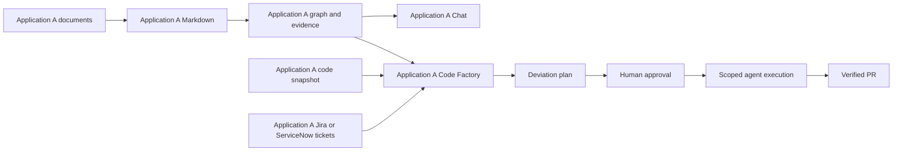

# Digital Brain — Application-isolated knowledge platform

Revised design • 12 September 2026 • Design only; no application implementation

[Platform and applications](platform-applications.html) · [SaaS infrastructure](architecture.html) · [Ingestion and graph quality](workflow.html) · [Code Factory workflow](code-factory-workflow.html) · [Code Factory and connector details](code-factory-and-connectors.md)

## 1. Definitive product model

**Every application owns its knowledge. Application knowledge is never shared with another application.**

The administrative hierarchy remains Organization → Portfolio → Product → Application → Code repositories. Organization identifies the SaaS tenant; Application is the knowledge security boundary. Portfolio and product are administrative groupings. Their dashboards show permitted names, ownership, operational status and usage counters, without aggregating documents, graph facts, ticket text, chat content or code findings.

Within each application the flow is:

**Upload document → preserve original → convert to Markdown → generate graph → verify graph quality → persist application knowledge.**

Two product experiences consume that application's knowledge: **Chat** answers questions with authorized evidence; **Code Factory** compares specifications against code and plans approved fixes. These are platform features activated for a selected application, not extra application records in the hierarchy.

Each application has its own documents, Markdown, graph, vectors, chat sessions, repository snapshots, ticket bindings, quality findings, deviation plans, approvals and agent runs. There is no organization-wide semantic search, cross-application traversal, shared agent memory, automatic document inheritance, or shared ticket corpus. Selecting a different application creates a fresh application-bound session.

A user may have access to several applications but works with one application knowledge context per request, conversation and factory run. A project-wide assessment means all authorized repositories, modules and documents **inside that application**. Work spanning applications must use independent runs and approvals; it must not pool their knowledge. Administrative parent changes do not move or expose knowledge automatically.

## 2. Proposed architecture and storage

Reuse stateless platform services while separating their application data and capabilities. Start with a modular API plus independently scalable ingestion, connector and agent workers. Deployment cloud and region remain open choices.

| Layer | Responsibility and isolation |
|---|---|
| SaaS control plane | Tenant provisioning, identity, hierarchy, plans and quotas; no default content access |
| Application workspace | Application selector, uploads, graph explorer, Chat, quality dashboard, Code Factory and settings |
| Identity/policy gateway | Authenticated organization membership plus explicit application and resource permissions |
| Application Knowledge API | Accept exactly one authorized application context; route to its storage and enforce source ACLs |
| Durable workflow service | Application-bound jobs, checkpoints, idempotency, retries, budgets and cancellation |
| Conversion worker | Sandbox scanning, MarkItDown, configured OCR fallback, conversion review and source mapping |
| Graph workers | Configurable model profiles, compatible OpenAI/Claude SDK runtimes and Graphify adapter, with application-limited tools |
| Quality/publish service | Validate staged graph, collect correction inputs and activate only complete graph versions |
| Chat service | Retrieve this application's evidence and generate cited answers or abstentions |
| Code Factory | Analyze pinned specifications/code/tickets, prepare deviation plans, enforce approvals and run bounded agents |
| Connector service | Per-application Jira/ServiceNow binding, restricted ticket sync and separately authorized writeback |
| Repository service | Per-application repository/path bindings, read snapshots and constrained branch/PR operations |

**Knowledge storage:** one graph database and one vector collection/index per application, each accessed with application-scoped credentials. Use separate private object containers per application for original files, Markdown, attachments and graph exports, with application-specific KMS keys. Encryption keys alone do not establish isolation: storage identities, policy enforcement and query routing must all agree. A graph engine such as Neo4j can sit behind a storage adapter; confirm database-per-application support, licensing and operational scale before selecting it. The application-boundary requirement is fixed even if the engine changes.

**Metadata storage:** shared PostgreSQL may hold hierarchy and non-content configuration with enforced row-level security. All application-owned records carry `(organization_id, application_id)`; composite foreign keys reject mismatched ownership. Content-bearing findings, conversations and plans require the same application isolation. Background jobs use scoped identities; no unscoped agent receives a pooled administrator database credential.

**Ephemeral storage:** cache keys include organization, application, permission fingerprint, policy version and knowledge version. Vector collections, Graphify work directories, model sessions, retrieval caches, worktrees and temporary artifacts are never reused across applications. Backups preserve application ownership and encryption boundaries. Credentials live in a secret manager; agents get narrowly scoped capability tokens rather than connector secrets.

## 3. Security contract

Every operation derives organization/application context from authenticated policy and verified resource ownership; a browser-provided ID is only a selection request. Object references, ticket IDs, graph IDs and job IDs are resolved within that context. A caller authorized for Application A must receive no data from B even when they guess B's resource ID.

A worker's signed job envelope includes organization, application, input versions, permitted operations, expiry, run ID and resource limits. The gateway routes to one application's stores; workers cannot select another database or collection. Recheck current authorization before upload finalization, retrieval, agent tool calls, plan approval, code execution, publication, export and writeback. Reject a job whose persisted application differs from its capability.

Enforce TLS, private storage and networking, workload identity and least privilege. Use short-lived signed object URLs for one object/action only. Scan uploads, bound archives and parsers, sanitize rendered Markdown and reject active content. Documents, ticket descriptions and repository text are untrusted data and cannot override tools, policy or approval state.

Within an application, source-level restrictions still apply. Each graph assertion retains evidence ACLs. Derived summaries, embeddings and paths cannot expose restricted evidence. Filter before agent retrieval and traversal; do not rely on final text redaction. A relationship supported by multiple restricted sources requires compatible access to those sources. Labels, counts and quality reports must not leak hidden facts.

Agents send only permitted context to approved model providers. Application-separated model session IDs and redacted tracing prevent platform-managed context mixing; verify provider retention, residency and data controls before production. No shared prompt corpus or fine-tuning corpus may contain application knowledge.

Repository bindings include branch and path allowlists. For a monorepo, sparse checkout alone is insufficient: a factory sandbox must not receive other applications' source, Git history, artifacts or credentials. Use a server-generated allowed-path snapshot and a broker to apply permitted diffs to a branch; shared or ambiguous files require an explicitly assigned ownership boundary before execution. Do not scan or clone an entire shared monorepo into the agent workspace.

Deletion first blocks access, then removes document versions, assertions, vectors, cached answers, exports and related artifacts by provenance. Backup recovery reapplies tombstones before serving data. Disabling an application binding revokes its active capabilities, stops queued jobs and blocks new reads immediately. Moving an application to another organization requires a separately designed migration; it is not a metadata edit.

## 4. Roles and authorization

Authentication may share an identity provider, but the SaaS admin console uses its own client/session audience. Application access is represented by explicit grants; administrative seniority alone does not grant all application knowledge.

| Role | Administrative rights | Application knowledge/execution rights |
|---|---|---|
| SaaS admin | Provision tenants, subscriptions and operational limits | No default content access or code execution |
| Organization admin | Manage identity, hierarchy, policy and permitted delegation | Application access only through explicit grants |
| Portfolio manager | Manage assigned portfolio/products and delegated settings | Separate application grants; no combined knowledge view |
| Product manager | Manage assigned product/applications; configure authorized bindings | Can curate/read/approve only applications explicitly granted |
| Application owner/maintainer | Configure application policies, sources and connector scopes | Read, curate and request analysis; approval rights explicit |
| Contributor | Upload or correct permitted application sources | Read granted evidence and propose plans; no default execution approval |
| Viewer | None | Read permitted application evidence and Chat |
| Factory approver | Application-specific plan approval grant | Approve bounded plans; no implicit repository merge/deploy authority |
| Auditor | Assigned audit scope | Audit metadata; source content needs a separate application grant |

Use distinct capabilities for `knowledge.read`, `knowledge.write`, `connectors.manage`, `factory.analyze`, `factory.approve`, `factory.execute`, `repo.pr.create`, `repo.merge` and `tickets.writeback`. Roles can bundle them. Delegation cannot exceed authorized scope. Approval decisions are recorded by the authenticated human; an agent cannot approve its own plan. Restricted classifications may require independent reviewers.

## 5. Document and graph workflow

1. User selects an application and uploads a document. API checks application access, classification, size/type and quota, then issues a private quarantine upload target.
2. Verify the original's checksum/type and scan it. Reject unsafe content. Preserve accepted originals unchanged.
3. Convert supported documents to Markdown using MarkItDown; use explicit OCR/vision fallback for scans and diagrams. Preserve images and source maps. Failed or incomplete conversions require corrected input instead of a silently incomplete graph.
4. Persist versioned Markdown inside this application. Chunk with evidence spans and source ACLs.
5. Run Graphify plus the SDK workers against only the application's approved corpus. Normalize extracted entities, relationships and evidence assertions into a staged graph. Code snapshots are structurally analyzed as code; they do not lose their native structure by being reduced to Markdown.
6. Run graph quality verification and owner corrections. Distinguish imported, extracted, reviewed and authoritative specification states. Publishing a knowledge graph does not automatically make every uploaded draft an approved requirement.
7. Build graph and vector projections for a new version. Atomically switch this application's active manifest only when both are ready. Keep failed builds invisible and retain the prior valid release.
8. Chat and Code Factory consume the persisted version through the application Knowledge API. Reuse stored knowledge; do not regenerate the graph for every question.

Idempotency keys include organization, application, document version, ontology and extraction configuration. Jobs have bounded retries and resumable checkpoints. Access revocation takes effect even when an index update lags.

## 6. Graph model and application features

Administrative hierarchy is authoritative metadata, not a graph-generated source of permissions. Each knowledge graph contains only its own application's entities and evidence.

Application B has an independent instance of this data flow with no knowledge connection to A.

Entity types include Requirement, Capability, Decision, API, Service, CodeSymbol, Test, DataEntity, Risk, Ticket, Deviation, FixPlan, Approval and ChangeSet. Relations include IMPLEMENTS, VERIFIES, SUPPORTS, CONTRADICTS, SUPERSEDES, REPORTS, ADDRESSES and VERIFIED_BY. All endpoints and evidence must belong to the same application. No graph-level cross-application dependency edge is permitted. If a local document names another system, retain only the local document's statement as local evidence; do not resolve it to another application's graph or fetch its private knowledge.

Assertions retain source version/span, repository commit/path where applicable, extraction configuration, confidence, review status and validity time. Preserve disagreements and source provenance; model agreement is not ground truth.

**Chat:** authenticate and choose application → retrieve permitted stored graph paths and source evidence → answer with citations and freshness → record the conversation in that application. Unsupported questions produce an explicit gap. Chat cannot switch application context mid-conversation or invoke code changes merely because a question requests a fix; it can prepare a factory proposal through the approval workflow.

**Code Factory:** select application and analysis scope → pin approved specification versions, graph version, allowed repository commits and ticket revisions → identify deviations/unknowns → present a reviewable plan → obtain application-specific approval → orchestrate fixes → verify and create review PRs → apply repository merge policy → reindex merged code and confirm gap closure → perform configured ticket updates. Full details appear in the companion design.

## 7. SDK and integration boundary

The coordinator and specialists use independently selected compatible model profiles. OpenAI Agents SDK and Claude Agent SDK are supported runtimes for scoped analysis, extraction and implementation; the selected task/model determines the compatible runtime. Integrate via typed job APIs/tools with a shared schema; native cross-SDK handoffs are not assumed. A durable orchestrator outside both SDK loops owns state, approvals, retries, resource budgets and cancellation.

Graphify.net is the selected graph-builder family. Place its local CLI/MCP behind an adapter with pinned version and normalized output. Confirm the exact repository, supported runtime and extension contract before implementation. Never send application knowledge to a public/shared graph gallery. Graphify export files are application-private artifacts; the platform owns durable storage and authorization.

No connectors, agent runtimes, repositories or cloud services are being configured during this design task.

## 8. Graph quality verification and improvement inputs

Quality is a dashboard of dimensions with non-negotiable security gates. A blended score cannot compensate for leaked permissions or missing provenance. Proposed initial targets below are acceptance hypotheses to calibrate with domain owners, not measured performance or library guarantees.

| Dimension | Verification / proposed gate | Input or correction requested |
|---|---|---|
| Tenant and permission integrity | Zero cross-application or cross-tenant edges; every published artifact has valid ACL; negative tests across roles, search, paths and exports | Correct scope bindings; split mixed-permission assertions; rebuild affected projections |
| Schema and referential integrity | 100% valid types, required fields, endpoints and evidence references; ownership hierarchy is acyclic | Approved ontology, canonical IDs, hierarchy/repository mapping |
| Evidence grounding | 100% published assertions have resolvable source spans; sampled support precision target ≥95% | Missing source document, exact section, code path/commit, or rejection of unsupported assertion |
| Entity resolution | Estimate false merges and duplicate rate on a labeled sample; no known critical false merge | Glossary, aliases, stable service IDs, examples distinguishing similarly named systems |
| Coverage | ≥90% of a curated set of expected entities/relations; report document/section coverage separately | PRDs, architecture decisions, API specs, ownership register, repository map and test traceability |
| Contradictions | Zero unresolved high-impact conflicts in released assertions; retain competing evidence in staging | Current authoritative decision, effective dates, reviewer ruling and supersession links |
| Freshness | All sources within scope-specific freshness policy; commits/versions tracked | New document revision, repository sync, owner reconfirmation or retirement date |
| Connectivity | Explain unexpected isolated nodes and missing expected paths; no arbitrary density target | Dependency inventory, interface contracts, deployment map or confirmation that isolation is intentional |
| Retrieval usefulness | Curated question set: proposed ≥90% evidence-backed answer success; abstain on unsupported questions | Representative user questions, expected answers/citations and known no-answer cases |
| Conversion quality | No known omitted critical sections; scanned/table-heavy samples visually compared with originals | Better scan, unlocked original, OCR correction, table export or diagram legend |

Use deterministic checks first, evidence-based model review second, and stratified human sampling for correctness. Sample by source type, relation type and risk within the application. Maintain a labeled benchmark with adjudicated evidence; report sample sizes and uncertainty. Recall is meaningful against that benchmark, not against unknowable total knowledge. Two models agreeing is not independent ground truth.

Every graph release includes a versioned quality report: dimensions, sample sizes, blockers, trends, affected sources and delta from the prior release. A security blocker always stops publication. Warning-only issues may publish under a scoped reviewer decision with reasons recorded. Application-specific thresholds must not weaken security gates.

### Improvement inbox

Each finding includes severity, affected entity/edge and source links, failed rule, evidence, why it matters, exact requested input, responsible owner, proposed correction, expected benefit and verification method. Findings inherit the permissions of their evidence. Prioritize by risk × user impact × scope, with effort as a planning input.

Examples:

- **Missing owner:** “Payments API has no verified owner. Product manager: supply the current ownership register or confirm a named team.” Verify the resulting OWNS assertion against that input.
- **Conflicting dependency:** “The architecture document names Billing v1; the approved repository snapshot calls Billing v2.” Request the migration decision and effective date; preserve historical validity.
- **Possible duplicate:** “Customer Service and customer-api may describe one system.” Request canonical ID and alias confirmation; preview merge impact before approval.
- **Poor coverage:** “Refund requirements have no verified test links.” Request the test plan or repository test mapping; re-evaluate the labeled requirement set.
- **Unreadable diagram:** “Three service labels could not be extracted.” Request a higher-resolution diagram or textual interface list; compare corrected extraction to the source.

Loop: detect → explain → assign → supply source/correction → preview graph diff → approve where required → rebuild affected scope → rerun checks → publish → measure improvement. Never invent edges to improve density or automatically merge ambiguous entities. Keep rejected suggestions to avoid repeating them.

## 9. Isolation acceptance criteria and remaining decisions

Before implementation can be considered production-ready, tests must prove that Application A cannot read B through graph search, vector search, document downloads, guessed IDs, cached answers, agent tools, repository paths, connectors, findings, exports or restored backups. Repeat these tests for the same user authorized in both applications to catch accidental context reuse. Attempt mismatched organization/application IDs, cross-application graph endpoints, replayed job tokens and webhook routing changes. Expected cross-boundary disclosures: zero.

Separate graph quality from code-fix quality: a coherent graph can still represent an unverified bug report, and passing tests does not prove all requirements are met. Maintain versioned benchmarks and evidence-based gap closure checks.

Decisions remaining: hosting region/residency, application count and storage economics, identity provider, Graphify compatibility, source size limits, repository host and ownership boundaries, Jira Cloud versus Data Center, ServiceNow version/auth capabilities, model data controls, recovery objectives and permitted ticket writeback transitions. Application isolation and approval-before-execution are fixed requirements.

## Sources and evidence boundaries

- [OpenAI Agents SDK](https://developers.openai.com/api/docs/guides/agents/sdk): application-controlled tools and orchestration; the coordinator architecture is proposed here.
- [Claude Agent SDK](https://code.claude.com/docs/en/agent-sdk/overview): specialist agent runtime; cross-SDK job integration is custom.
- [MarkItDown](https://github.com/microsoft/markitdown): Markdown conversion; intake security and conversion validation belong to this platform.
- [Graphify.net](https://graphify.net/): graph extraction/build/export description; exact integration compatibility remains to be verified.

Only architecture documents and local diagram artifacts have been created or revised.

## Model flexibility and developer access

[Model selection policy](model-selection.md) applies to every stage and individual agent: users select compatible profiles within application permissions, with explicit fallbacks and audited execution. Code Factory approval pins the model map; embedding changes rebuild the corresponding index. [Application REST and MCP access](developer-access.md) exposes the same authorized retrieval pipeline to developer code and coding assistants. External calls cannot cross application boundaries or bypass source permissions and Factory approval. The consolidated narrative includes both contracts in full.

